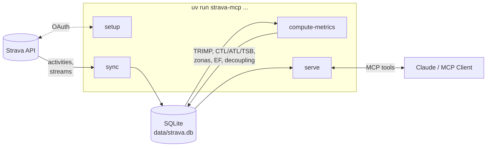
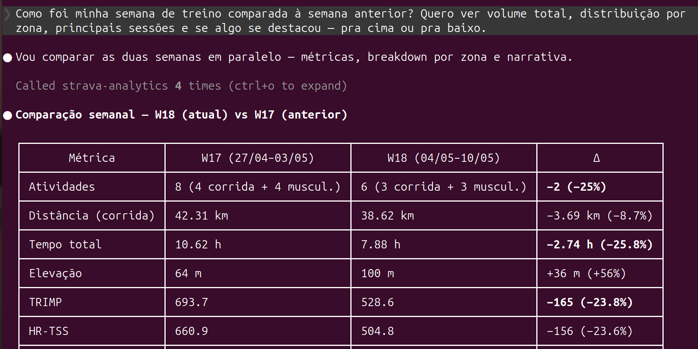
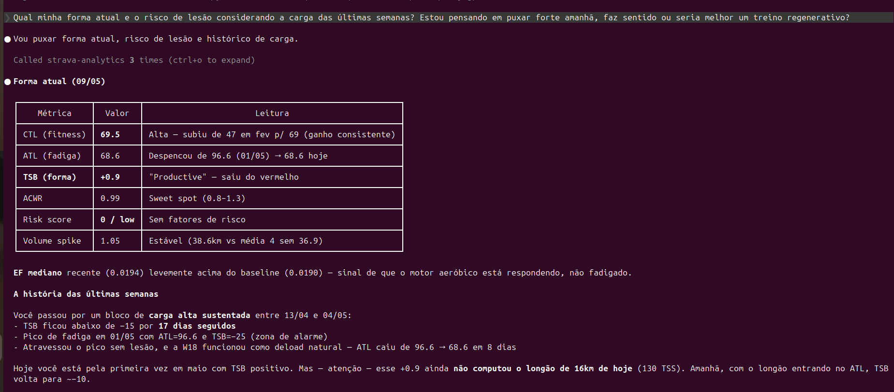
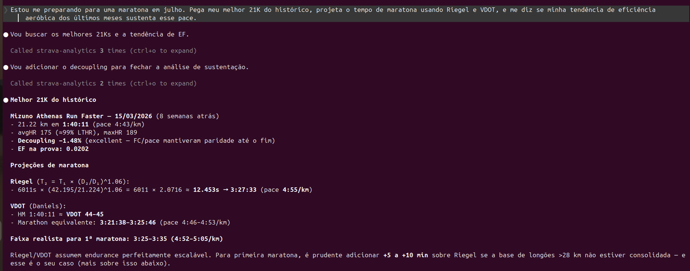

# Strava Analytics MCP

[](https://github.com/jpedrosantana/strava_analytics_mcp/actions/workflows/ci.yml)
[](LICENSE)
[](https://www.python.org/downloads/)

Plataforma pessoal de análise esportiva via [Model Context Protocol](https://modelcontextprotocol.io/).
Sincroniza o histórico completo do Strava, aplica modelos de ciência do esporte e expõe insights como tools consumíveis por Claude Code, Claude Desktop ou qualquer cliente MCP compatível.

## O que isso faz

- Cache local SQLite com todo o histórico de atividades (backfill + sync incremental)
- Métricas científicas calculadas localmente: TRIMP, hrTSS, CTL/ATL/TSB, zonas Friel, NGP, eficiência aeróbica, decoupling cardíaco
- 20 tools MCP para o Claude analisar seus dados de treino via linguagem natural
- Risco de lesão baseado em ACWR e spikes de volume
- Predições de prova (Riegel + VDOT), clustering de rotas (DBSCAN) e ranking de drivers de performance via Gradient Boosting
- Narrativa estruturada de períodos e diagnóstico de platô para o LLM consumir como coach

## Arquitetura



`setup` faz o handshake OAuth uma única vez. `sync` baixa atividades e streams da Strava para o SQLite local. `compute-metrics` lê o banco, calcula as métricas científicas e grava de volta. `serve` expõe o banco como tools MCP para qualquer cliente compatível.

## Aviso de uso

Este é um projeto pessoal e exploratório. As métricas e diagnósticos (TRIMP, CTL/ATL/TSB, eficiência aeróbica, VDOT, predições de prova, risco de lesão) vêm de modelos heurísticos consagrados na literatura de ciência do esporte — coeficientes derivados de médias populacionais, não de avaliação laboratorial individual. Os resultados servem como apoio à decisão de treino e visibilidade do progresso, **não substituem treinador, profissional de educação física ou médico do esporte**. Mudanças de carga, suspeita de lesão ou prescrição de prova devem ser discutidas com um profissional.

## Pré-requisitos

- Python 3.11+
- [uv](https://docs.astral.sh/uv/)
- Conta Strava com app criado em [developers.strava.com](https://developers.strava.com)

## Instalação

```bash
git clone https://github.com/<seu-usuario>/strava-analytics-mcp
cd strava-analytics-mcp
cp .env.example .env          # preencha com CLIENT_ID e CLIENT_SECRET
uv sync
```

## Uso

```bash
# 1. Autenticar com a Strava API (abre navegador)
uv run strava-mcp setup

# 2. Backfill completo: atividades + streams (FC/pace/altitude) + métricas analíticas
#    Streams são necessários para eficiência aeróbica, decoupling e best efforts.
uv run strava-mcp sync --full --streams --compute

# 3. Verificar saúde dos dados
uv run strava-mcp doctor

# Outros comandos
uv run strava-mcp sync                    # sync incremental (novidades desde último sync)
uv run strava-mcp sync --streams          # baixar streams para atividades antigas
uv run strava-mcp compute-metrics         # recalcular métricas após mudança em athlete_config
```

## Integração com Claude Code

Crie o arquivo `.mcp.json` na raiz do projeto (já está no `.gitignore` — cada máquina configura o próprio):

```json
{
  "mcpServers": {
    "strava-analytics": {
      "command": "uv",
      "args": ["run", "strava-mcp", "serve"],
      "cwd": "/caminho/absoluto/para/strava_analytics_mcp"
    }
  }
}
```

O `.claude/settings.json` do repositório já contém `enableAllProjectMcpServers: true`, que aprova automaticamente o servidor ao abrir o projeto. Reinicie o Claude Code e o servidor estará disponível.

> **Nota:** Se `uv` não estiver no PATH do Claude Code, use o caminho completo do executável (ex: `/home/user/.local/bin/uv`).

## Análises possíveis

Com o servidor rodando, o Claude consegue responder perguntas como:

**Forma e prontidão**
- *"Qual minha forma atual? Estou pronto para um treino pesado amanhã?"*
- *"Qual o risco de lesão considerando minha carga recente?"*
- *"Estou em platô? Diagnostique baseado nas últimas 12 semanas."*

**Tendências de longo prazo**
- *"Minha eficiência aeróbica está melhorando nos últimos 3 meses?"*
- *"Como meu CTL evoluiu desde janeiro?"*
- *"Quais features mais influenciam meu pace? Ranqueie por importância."*

**Análises pontuais**
- *"Como foi meu treino esta semana comparado à semana passada?"*
- *"Liste as corridas longas do último mês com pace e FC média."*
- *"Quais foram minhas 3 atividades de maior carga este mês?"*
- *"Detecte corridas com pace fora do esperado nos últimos 60 dias."*
- *"Onde corri com mais frequência este ano? Mostre os clusters de rota."*

**Preparação de prova**
- *"Qual foi meu melhor 21 km? Com qual pace?"*
- *"Projete meu tempo de maratona baseado no histórico."*

## Demonstração

Conversas reais com o Claude usando o MCP — capturas reais do projeto em uso:

> Screenshots em construção. As imagens abaixo ficam em `docs/screenshots/`; basta substituir os arquivos.



[Ver conversa completa →](docs/conversations/weekly-analysis.md)



[Ver conversa completa →](docs/conversations/form-diagnosis.md)



[Ver conversa completa →](docs/conversations/race-prediction.md)

## Tools MCP disponíveis

| Tool | Descrição |
|------|-----------|
| `list_activities` | Atividades dos últimos N dias com pace, FC, distância |
| `get_activity` | Detalhes de uma atividade (+ métricas calculadas opcionais) |
| `search_activities` | Busca por nome, distância, data, esporte |
| `get_period_stats` | Totais e médias de um período (distância, tempo, TSS, zonas) |
| `compare_periods` | Comparação lado-a-lado entre dois períodos |
| `get_weekly_breakdown` | Volume semana-a-semana das últimas N semanas |
| `get_current_form` | CTL, ATL, TSB e ACWR de hoje com histórico de 14 dias |
| `get_load_history` | Série histórica diária de carga de treino |
| `get_injury_risk_assessment` | Score de risco de lesão (ACWR + spikes de volume + degradação de EF) |
| `find_anomalies` | Detecta corridas com pace fora do esperado via regressão sobre o histórico |
| `get_route_clusters` | Agrupa corridas por ponto de partida recorrente (DBSCAN) e faixa de distância |
| `what_drives_my_performance` | Ranqueia features que mais influenciam pace via Gradient Boosting |
| `generate_period_narrative` | Resumo estruturado de um período (highlights, comparações, concerns) para narração pelo LLM |
| `diagnose_plateau` | Diagnóstico de platô com 4 indicadores e sugestões concretas |
| `get_aerobic_efficiency_trend` | Tendência mensal de EF em corridas |
| `get_decoupling_trend` | Decoupling cardíaco em corridas longas (≥60min) |
| `find_personal_records` | Melhores tempos em distâncias-padrão (5K, 10K, 21K, maratona...) |
| `predict_race_time` | Projeção de tempo via Riegel + VDOT em qualquer distância |
| `sync_now` | Dispara sync incremental (ou full) via tool |
| `athlete_doctor` | Diagnóstico de completude e qualidade dos dados |

## Configuração do atleta

Algumas métricas (TRIMP, zonas, hrTSS) são mais precisas com parâmetros configurados:

```bash
sqlite3 data/strava.db "
INSERT OR REPLACE INTO athlete_config VALUES ('lthr',    '165', datetime('now'));
INSERT OR REPLACE INTO athlete_config VALUES ('hr_max',  '187', datetime('now'));
INSERT OR REPLACE INTO athlete_config VALUES ('hr_rest', '50',  datetime('now'));
INSERT OR REPLACE INTO athlete_config VALUES ('sex',     'male', datetime('now'));
"
```

Se não configurados, LTHR e FCmáx são estimados automaticamente do histórico de corridas.

## Documentação

- [Métricas de Treinamento](docs/METRICS.md) — explicação de TRIMP, hrTSS, EF, Decoupling, CTL, ATL, TSB, ACWR e Status
- [Exemplos de System Prompts para Modo Coach](docs/COACH_PROMPTS.md) — templates para usar o MCP como treinador pessoal
- [Troubleshooting](docs/TROUBLESHOOTING.md) — OAuth, rate limit, sync interrompido, gaps de stream, reset do banco, agendamento local
- [Notebook de exemplo](examples/exploration.ipynb) — uso direto das funções de `analytics/` sem MCP, com plots de CTL/ATL, EF e predição de prova
- [Como contribuir](CONTRIBUTING.md) e [Código de conduta](CODE_OF_CONDUCT.md)

## Roadmap

| Fase | Descrição | Status |
|------|-----------|--------|
| 0 | Fundação: estrutura, tooling, CI | ✅ |
| 1 | Cliente Strava + OAuth | ✅ |
| 2 | Banco SQLite + sync (backfill, incremental, streams) | ✅ |
| 3 | Analytics core (TRIMP, CTL/ATL/TSB, zonas, NGP, EF) | ✅ |
| 4 | MCP server v0.1 — 13 tools, usável no Claude | ✅ |
| 5 | Predições (Riegel, VDOT); clima opcional ([ADR 0002](docs/decisions/0002-weather-integration-optional.md)) | ✅ |
| 6 | ML e análises avançadas (anomalies, clustering, performance drivers) | ✅ |
| 7 | Narrativa e diagnóstico (period narrative, plateau diagnosis, coach prompts) | ✅ |
| 8 | Ajustes finos pós-review (diagrama, troubleshooting, auditoria, expansão do backlog) | ✅ |
| 9 | Polish e portfólio (README, notebook, CI, governança) | — |
| 10 | Conteúdo público (post conectando MCP + projeto de BI) | — |

## Stack

Python 3.11 · FastMCP · SQLite · SQLAlchemy · httpx · pandas · numpy · scipy · scikit-learn · typer · pydantic · structlog · uv · ruff · pytest
