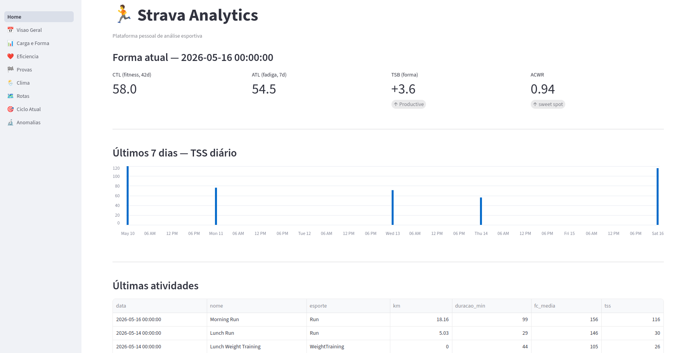
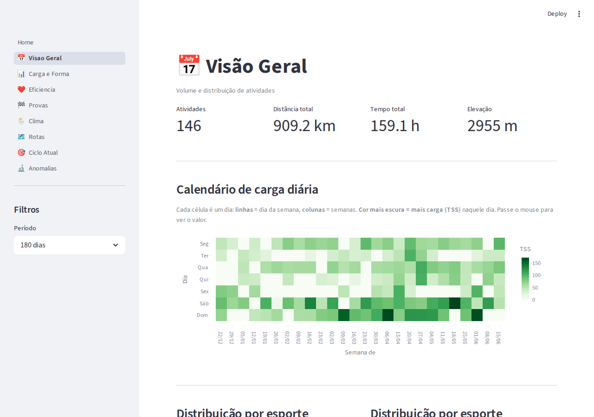
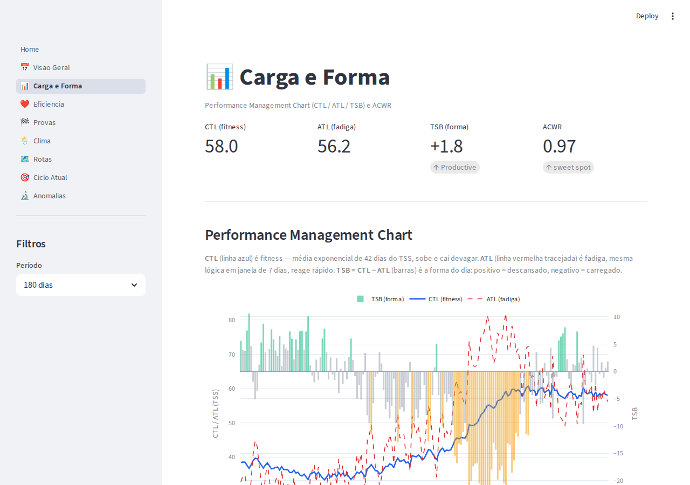
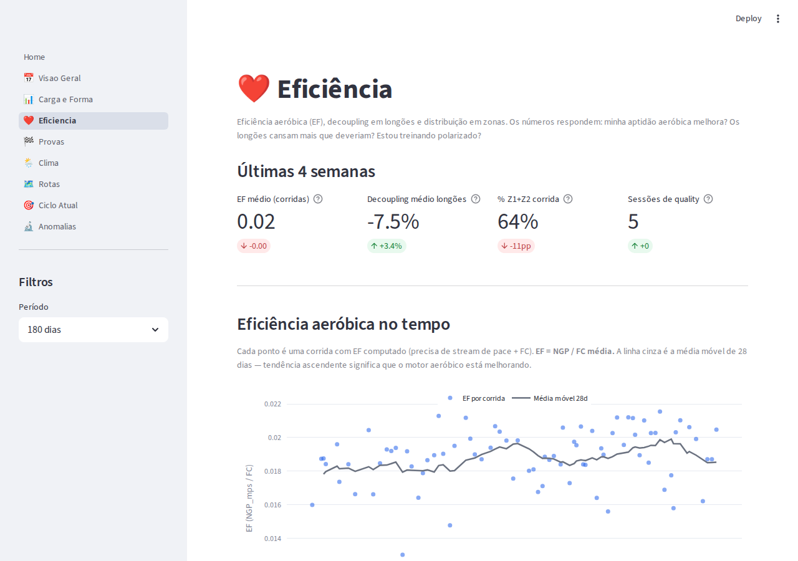
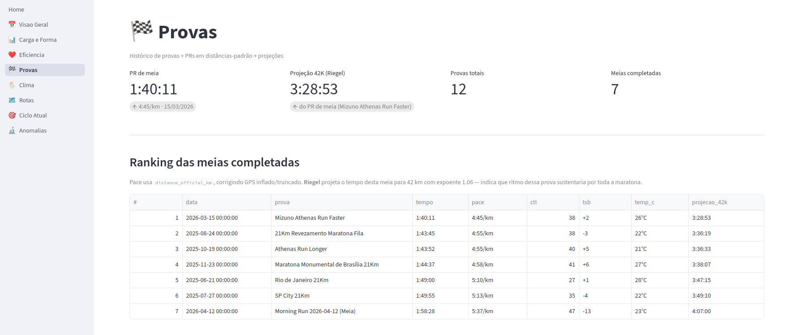
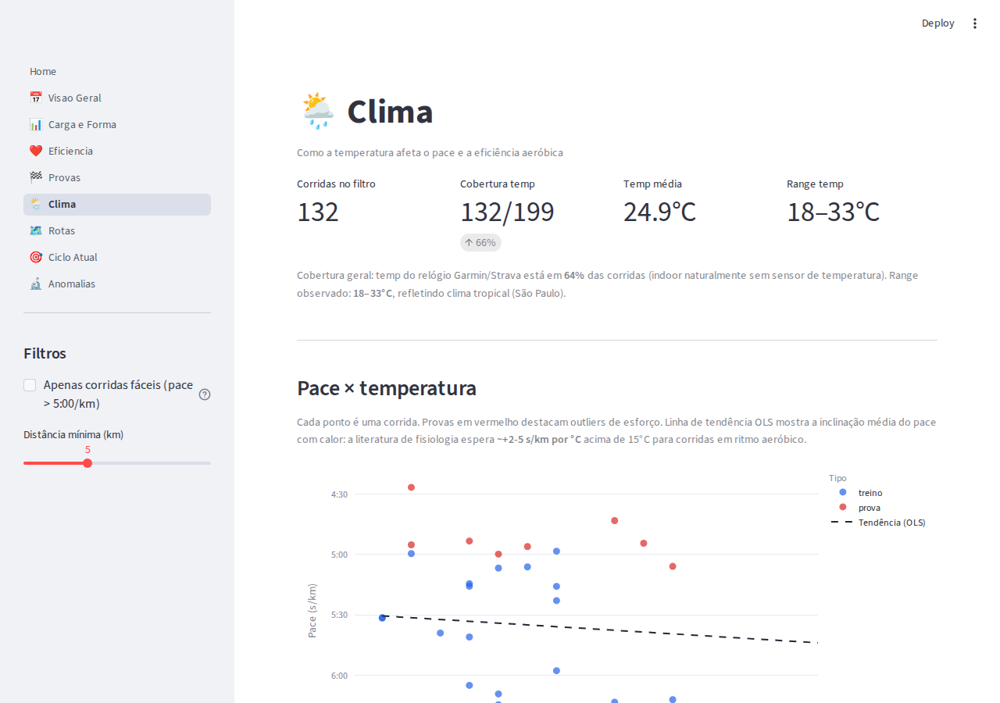
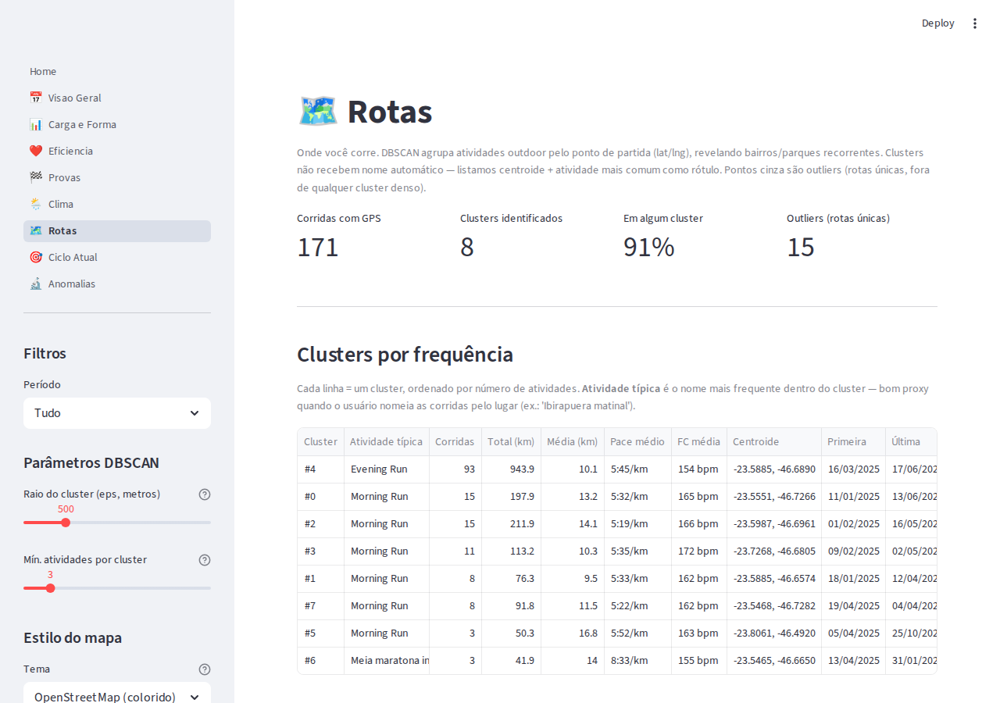
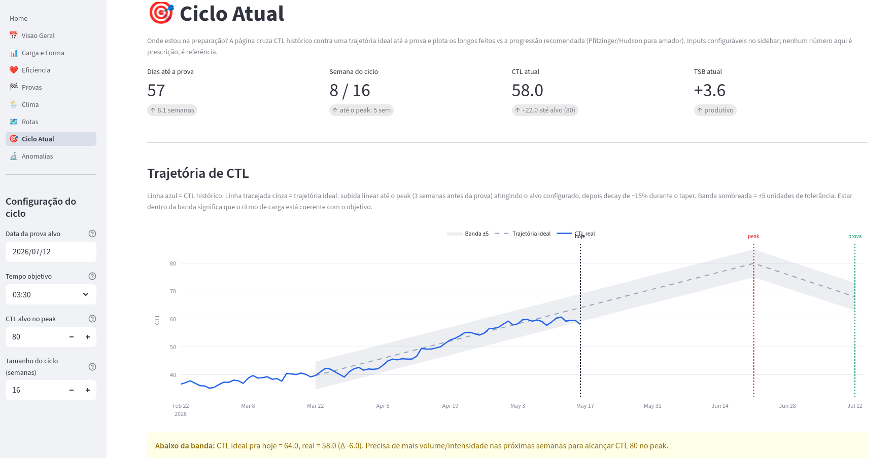
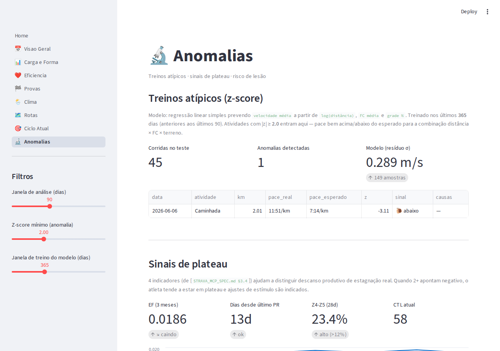

# Dashboard Streamlit

Tour das 8 páginas do dashboard local, gerado a partir do warehouse DuckDB.

```bash
./scripts/transform.sh    # rebuilda os marts dbt → DuckDB
./scripts/dashboard.sh    # sobe o Streamlit em http://localhost:8501
```

Atalho para os usuários do MCP: o mesmo banco que alimenta as tools do Claude (`data/strava.db`) é a fonte do warehouse analítico (`data/strava.duckdb`), via `compute-metrics` + `dbt build`. Mudou algo na origem, basta rebuildar.

---

## Landing — Forma atual



Card de abertura. Mostra a **forma do dia** (CTL fitness, ATL fadiga, TSB balance, ACWR), e o **TSS diário das últimas 7 sessões**.

Pergunta que responde: *"como cheguei em hoje?"*

---

## 1 · Visão Geral



Volume total, distribuição por esporte, heatmap de calendário e ritmo de atividades por período. Filtro de janela no sidebar (30 / 90 / 180 / 365 dias / Tudo).

Pergunta que responde: *"qual o ritmo geral do meu treino nos últimos N dias?"*

---

## 2 · Carga e Forma



**Performance Management Chart** clássico (Banister): linha de **CTL** (fitness, exp moving avg 42d), **ATL** (fadiga, 7d) e **TSB** (balance, CTL − ATL). Banda colorida nos TSB de zonas Fresh / Productive / Loaded / Risk. Painel inferior com **ACWR** (Acute:Chronic Workload Ratio) marcando o "sweet spot" 0.8–1.3.

Pergunta que responde: *"estou treinando mais ou menos? estou recuperado pra dar carga ou pra recuar?"*

---

## 3 · Eficiência



Três blocos:

- **Cards** comparando últimas 4 semanas vs 4 anteriores (EF médio, decoupling, % Z1+Z2, sessões de quality)
- **Tendência do EF** (NGP ÷ FC) por corrida no tempo, com média móvel 28d
- **Decoupling dos longões** (Pa:HR) com bandas verde/vermelha para fadiga aeróbica
- **Distribuição em zonas por semana** — barras empilhadas com linha de referência em 80% para polarização Z1+Z2

Pergunta que responde: *"o motor aeróbico está melhorando? estou treinando polarizado?"*

---

## 4 · Provas



Três blocos:

- **PRs em 8 distâncias padrão** (1K–42K). Marca `Segmento` (PR setado dentro de um treino maior) vs `Prova` (corrida cuja distância total bate com a label). Distâncias ainda não rodadas aparecem como "—"
- **Histórico de provas** — tabela das 12 provas registradas (7 meias completadas + outras) com tempo, pace (corrigido pela distância oficial quando disponível), FC média, clima, CTL/TSB do dia e ranking entre provas da mesma distância
- **Projeção Riegel→42K** — gráfico horizontal com a maratona projetada de cada prova (expoente 1.06), colorido por distância da prova-base. Meias têm peso muito maior que 5Ks; destaque pra melhor projeção via meia

Pergunta que responde: *"como meu nível de prova evoluiu? que maratona eu sustento hoje?"*

---

## 5 · Clima



Três blocos:

- **Scatter pace × temperatura** com tendência OLS via `numpy.polyfit`. Mostra a inclinação observada em s/km por °C — literatura espera +2-5 s/km/°C acima de 15°C
- **Boxplot por faixa térmica** (<20°C / 20-23 / 23-26 / 26-29 / ≥29°C)
- **Scatter EF × temperatura** com mesma tendência

Filtros: distância mínima e "apenas corridas fáceis" (pace > 5:00/km) pra remover ruído de intervalados.

Caveat: ~64% das corridas têm `weather_temp_c` (indoor naturalmente sem cobertura).

Pergunta que responde: *"quanto o calor está custando no meu pace? a eficiência cai com a temperatura?"*

---

## 6 · Rotas



**Clustering geográfico** das corridas outdoor (DBSCAN com métrica haversine, `eps` configurável em metros). Identifica bairros/parques recorrentes a partir do ponto de partida.

- **KPIs** — corridas com GPS, número de clusters, % em algum cluster, contagem de outliers (rotas únicas)
- **Tabela** por cluster — atividade típica, número de corridas, km total, pace médio, FC média, centroide e janela temporal
- **Mapa** Plotly `scatter_map` com pontos coloridos por cluster e tamanho proporcional à frequência. 5 estilos selecionáveis (OSM, Carto Voyager/Positron/Darkmatter, fundo branco). Selectbox pra focar num cluster

Pergunta que responde: *"onde eu corro com mais frequência? como minhas rotas se distribuem geograficamente?"*

---

## 7 · Ciclo Atual



Painel de preparação para a prova alvo. Inputs configuráveis no sidebar: **data alvo** (default maratona NB Porto Alegre 12/07/2026), **tempo objetivo**, **CTL alvo no peak**, **tamanho do ciclo**.

- **KPIs** — dias até a prova, semana atual do ciclo, CTL atual com gap até o alvo, TSB classificado (Fresh / Productive / Loaded / Risk)
- **Trajetória de CTL** — linha azul (real) sobreposta a trajetória ideal tracejada (start → peak no D-21 → race com decay ~15% no taper). Banda ±5 unidades de tolerância, callout colorido conforme o gap atual
- **Longos do ciclo vs progressão recomendada** — scatter dos longos (≥14 km ou ≥90 min) sobreposto a curva Pfitzinger-style (subida linear 14→32 km até peak, depois taper 32/26/21/16 km). Hover mostra pace e decoupling

Pergunta que responde: *"estou no ritmo certo de preparação? meus longos estão acompanhando a progressão recomendada?"*

---

## 8 · Anomalias



Três blocos:

- **Treinos atípicos** — modelo de pace (`fit_pace_model` + `detect_outliers` do MCP), flagga corridas com z ≥ threshold configurável. Mostra causas plausíveis (TSB alto/baixo, prova, intervalado)
- **Sinais de plateau** — 4 indicadores: EF mensal nos últimos 6 meses, days-since-PR (de `fct_pr_efforts`), % de tempo em Z4-Z5 nas últimas 4 semanas, CTL atual
- **Risco de lesão** — `assess_injury_risk` com 3 inputs computados dos marts (ACWR, volume spike 7d/4w, ΔEF 14d vs 30-60d). Barra visual colorida (Low / Moderate / High)

Pergunta que responde: *"alguma sessão está fora da curva? estou em platô? estou em zona de risco de lesão?"*

---

## Stack visual

- **Plotly Express + Graph Objects** — todos os gráficos
- **Streamlit cache (`@st.cache_data(ttl=3600)`)** nas queries — latência <100ms para mudança de filtro depois do primeiro load
- **MapLibre** via `px.scatter_map` (sem token Mapbox) na página de Rotas
- **Tema sóbrio** — paleta semântica para TSB (verde Fresh → cinza Productive → laranja Loaded → vermelho Risk), zonas de FC em escala verde-amarelo-laranja-vermelho

## Ler também

- [Métricas de Treinamento](METRICS.md) — fundamentação científica de TRIMP/CTL/ATL/TSB/EF/Decoupling/ACWR
- [ADR 0004 — DuckDB + sequenciamento da camada de dados](decisions/0004-data-layer-duckdb-and-sequencing.md) — por que dbt + DuckDB e não Postgres + Cube
- [BACKLOG](BACKLOG.md) — melhorias mapeadas, incluindo qualidade de dados (GPS inflado, HR spikes) e enriquecimentos do dashboard
